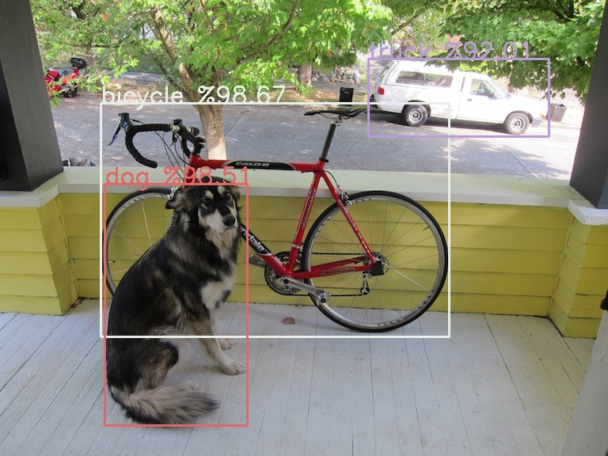
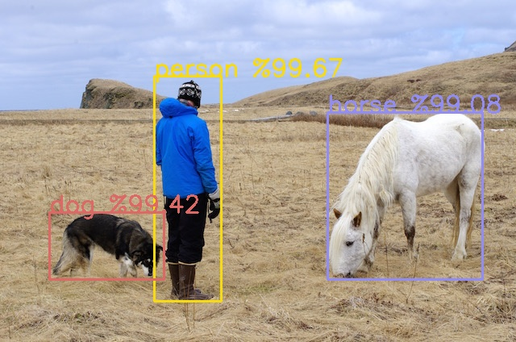

## Yolo predictor
### Predict images with tensorflow converted darknet yolov4 model in a single line.
---

  [](https://github.com/cccaaannn/yolo_predictor/blob/master/LICENSE)


## Before starting
- Yolo predictor predicts single or multiple images with [darknet yolo](https://github.com/AlexeyAB/darknet) model
- Model has to be converted to tensorflow, you can use this repo for converting the model [github.com/hunglc007/tensorflow-yolov4-tflite](https://github.com/hunglc007/tensorflow-yolov4-tflite)
- Tested with tensorflow 2.4.0


## Usage
### Predict a single image
```shell
python predict.py -m model_files/yolov4_coco -n model_files/coco.names -i test_images/dog.jpg --show
```

### Predict a directory of images
```shell
python predict.py -m model_files/yolov4_coco -n model_files/coco.names -d test_images --show
```

### Save predicted images
```shell
python predict.py -m model_files/yolov4_coco -n model_files/coco.names -d test_images --save_folder test_results
```

### All arguments
```
Model arguments:
  -m, --model_path          Tensorflow converted saved model FOLDER path
  -n, --names_path          Class (names) file path

Image arguments:
  -d, --dir_path            Directory of the images
  -i, --image_path          Path of the image

Draw arguments:
  -s, --show                Draw and show images with bounding boxes
  --save_folder             Save folder for drawn images with bounding boxes
  --resize                  Resize images with given dim, Ex: 1280 720
  --suffix                  Saved file suffix. Ex: '_predicted' dog.jpg -> dog_predicted.jpg
```

## Example results
</br> </br>

### For more flexibility you can use yolo_predictor class
```python
from yolo_predictor import yolo_predictor
from yolo_drawer import yolo_drawer

model_path = "model_files/yolov4_coco"
names_path = "model_files/coco.names"
image_path = "test_images/dog.jpg"

predictor = yolo_predictor(model_path, names_path)

predictions = predictor.detect(image_path)
print(predictions)

drawer = yolo_drawer()
drawer.draw(predictions, image_path, show=True, resize=False)
```

### Output
```
[(class_name, class_index, confidence, (x, y, w, h)), (class_name, class_index, confidence, (x, y, w, h)), ...]
```
```shell
[('bicycle', 1, 0.9867098, (0.4529685378074646, 0.48244842886924744, 0.573084, 0.5117002)), ('dog', 16, 0.98514426, (0.28938552737236023, 0.6685629785060883, 0.23469335, 0.5305287)), ('truck', 7, 0.92009175, (0.754764.7547647655010223, 0.2147115096449852, 0.296138, 0.16953142))]
```